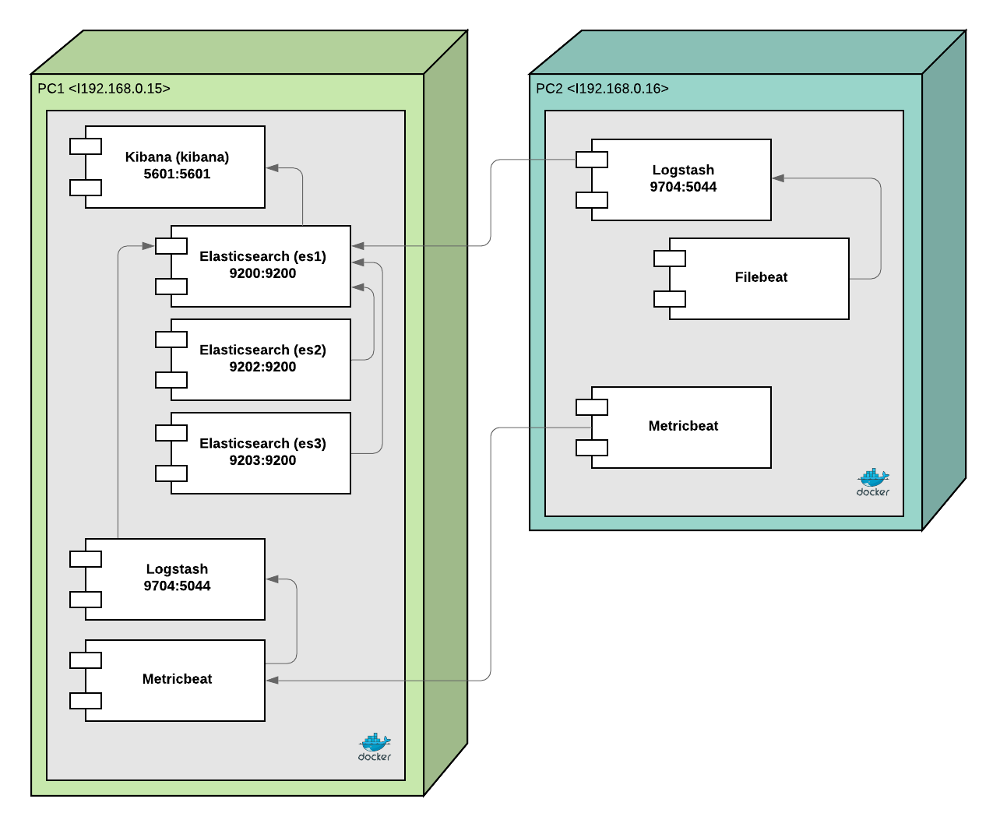

# ELK Cluster

## VM Creation

1. Create two virtual machines using ubuntu server, in this case, the solution was developed using ubuntu server v20.04
2. Enable internal network in both machines and set them with the same network

## Configuration

The next configutatios must be follow to have a succesfull implementation of the solution proposed

### 1. Docker Installation

### 1.1 Uninstall old versions

Older versions of Docker were called docker, docker.io, or docker-engine. If these are installed, uninstall them:
`sudo apt-get remove docker docker-engine docker.io containerd runc`

#### 1.2 Install using repoisitory

1.2.1 Set up the repository

- `sudo apt-get update`
- `sudo apt-get install \ pt-transport-https \ ca-certificates \ curl \ gnupg-agent \ software-properties-common`

  1.2.2 Add Docker's official GPC key

- `curl -fsSL https://download.docker.com/linux/ubuntu/gpg | sudo apt-key add -`

Verify that you now have the key with the fingerprint 9DC8 5822 9FC7 DD38 854A E2D8 8D81 803C 0EBF CD88, by searching for the last 8 characters of the fingerprint.

- `sudo apt-key fingerprint 0EBFCD88`
- `sudo add-apt-repository \ "deb [arch=amd64] https://download.docker.com/linux/ubuntu \ $(lsb_release -cs) \ stable"`

#### 1.3 Install Docker Engine

1.3.1 Update the apt package index, and install the latest version of Docker Engine and containerd, or go to the next step to install a specific version

- `sudo apt-get update`
- `sudo apt-get install docker-ce docker-ce-cli containerd.io`

  1.3.2 Install a specific version of Docker Engine

- `sudo apt-get install docker-ce=<VERSION_STRING> docker-ce-cli=<VERSION_STRING> containerd.io`

#### 1.4 Install Docker Compose

- `sudo apt install docker-compose`

### 2. Install Java JDK & JRE

#### 2.1 Install Java JRE

- `sudo apt install default-jre`

#### 2.1 Install Java JDK

- `sudo apt install default-jdk`

### 3. Set Enviroment Variables

#### 3.1 SYSCTL on 262144

- `sudo nano /etc/sysctl.conf`
- Add the following statement at the end of the file: `vm.max_map_count=262144`

#### 3.1 Configure memory locks limits

- `sudo nano /etc/security/limits.conf`
- Add the following statement at the end of the file:
  - `elastic soft memlock unlimited`
  - `elastic hard memlock unlimited`

### 4. Configure Internal Network

#### 4.1 edit the file /etc/netplan/00-installer-config.yaml

- `sudo nano /etc/netplan/00-installer-config.yaml`
- Add the next statement to the file, and configure the following IPs
  - For PC1: 192.168.0.15/24
  - For PC2: 192.168.0.16/24

```
    enp0s8:
           addresses: [192.168.0.3/24]
           dhcp4: false
```

## Running the solution

#### 1. Copy Files

Copy the files into the computers, files are group by PC, so just drag and drop the respective files into `/home/` directory.

Ej. The directory `/home/` for PC1 should look as follows:

```
   Elasticsearch Cluster
    >>> files
    >>> files
   Logstash
    >>> files
    >>> files
   Metricbeat
    >>> files
    >>> files
```

#### 2. Run Containers

Run the command `sudo docker-compose up` inside each folder that contain a docker-compose.yml file.

## Enjoy

Wujuu! You just set up a 2 PC cluster using the ELK stack, the attached image gives a visual representation of the infrastructure you just raised


